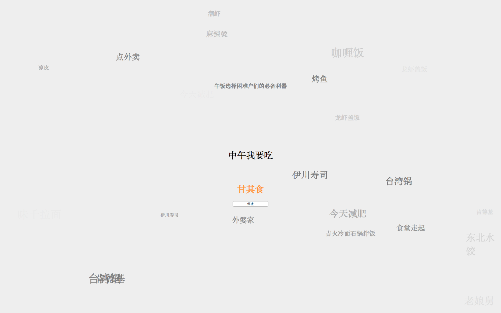
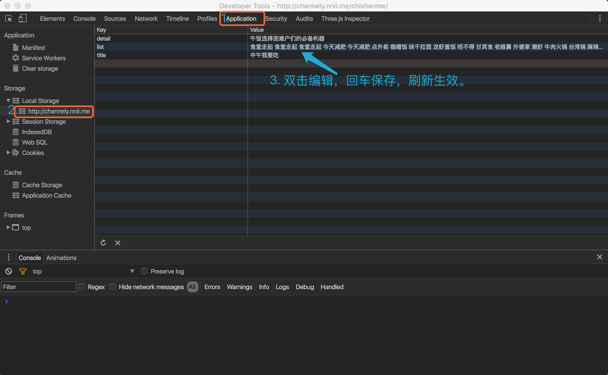

# 中午吃什么

中午吃什么是一个用来解决「中午吃什么」的应用，简单，小巧，能够迅速的帮助人们解决苦恼，消除纠纷。

无数个上班的日子、无数栋写字楼、无数个团队、无数个上班族、无数个工作群、无数个高矮胖瘦各不相同的个体每天都会的问题，「中午吃什么」，从现在起，就这个现状就要被改变。

###  界面效果截图 

### 

### 内容定制

## 协议

基于 [WTFPL](https://en.wikipedia.org/wiki/WTFPL) 协议开源。
